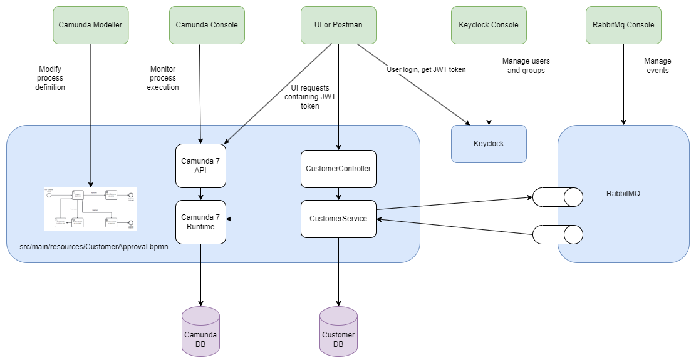

# Camunda Example
This example shows how to use Camunda 7 process engine embedded in Spring Boot application.
Usage scenario includes:
- Oracle database for storing both business data and process data
- RabbitMq for publishing end receiving events generated during process execution
- SSO integration using Keyclock




## Business Scenario
Example business process is dedicated to approving new Customers. 
Customer can be added to database with "APPROVED" status only when accepted by someone from management.
Manager can simply approve, but could also reject such Customer or mark it as incomplete,
in such case someone from Sales department would have to correct any invalid/missing data.   

Business process file is located in src/main/resources. It can be opened and modified using Camunda Modeler.


Defined users:
- "mary", password: "demo" assigned to "sales" group
- "peter", password: "demo" assigned to "management" group
- "demo", password: "demo"  : administrator

### Example Process Flow
- User adds Customer as candidate, Customer data is stored to database, Customer approval process is started,
  new process instance is created with CustomerId set as process variable.
- Process reaches user task "Approve Customer" and waits for user decision
- user "peter" checks his current task list and discovers that there is new task assigned to his group "management"
- "peter" claims this task and makes decision to set Customer record as incomplete (other possible decisions are: "approve" or "reject" )
- since "peter" decision was "incomplete" process continues to service task: "Mark Customer as Incomplete",
   spring bean is invoked changing Customer candidate status in database 
   and finally another user task is created : "Supplement Customer Data". Process waits on this stage
- When "mary" checks her task list, she discovers that there is new task assigned to her "sales" group, 
  she claims the task, corrects missing data and marks this task as completed. Process continues to next stage,
  which is: "Approve Customer" again, process stops on this stage
- When "peter" checks his task list, he can check Customer data again and if everything is correct he can finally
  approve, service task is invoked marking Customer record as APPROVED in database, process ends.

## Installation
- Install JDK version 17 or higher
- install Postman
- Install Camunda Modeler (Optional) from https://camunda.com/download/modeler/
- Install Docker Engine (required for RabbitMq, Oracle and Keyclock). If you run this example on Windows, Docker Desktop is not required.
There is another method using WSL2 and Ubuntu (https://www.paulsblog.dev/how-to-install-docker-without-docker-desktop-on-windows/)
Idea is also able to connect to Docker Engine installed on WSL2.
- optionally : access Keyclock on http://localhost:28080/ , login as admin/admin, import users from
  "keyclock-realm-export.json" located in test/resources (this will allow generating new JWT tokens). 
   Note : additional Keyclock configuration is required to create users : "peter" and "mary"
   and create groups: "sales" and "management". User "peter" should be in group "management" and "mary" in "sales".  
   Additional mapping should be added in order to add user groups to JWT token.

## Running application
- Run from app root directory
```
  docker-compose up
```
- Run CamundaExampleApp from its root directory

```
  ./mvnw spring-boot:run
```

## Testing
- Import postman collection from test/resources
- Use existing POSTs to add some Customer candidates
- Check if Customer candidates were added by using GET all Customers
- Access Camunda GUI : http://localhost:8080, user: demo, pass: demo
- Use Cockpit, Tasklist for checking process state, executing user tasks, etc.
- Use RabbitMq cockpit at  http://localhost:15672/ user:guest, pass:guest to see events generated during creating and accepting of new Customer 

